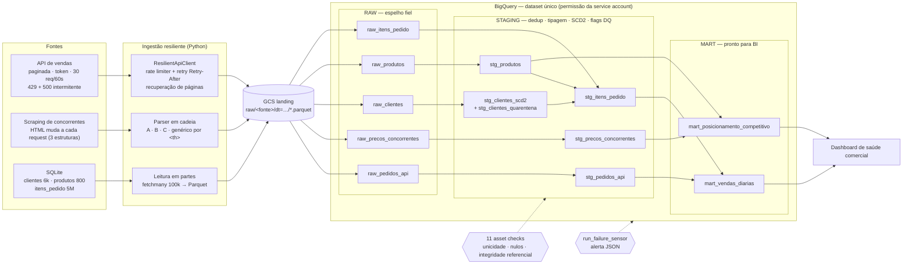

# Teste Técnico — Analytics Engineer Sênior — Vena BPO Suprimentos

**Candidato:** Paulo Adauto Pazuch Barbosa

Pipeline ELT que alimenta um dashboard diário de "saúde comercial" consolidando
3 fontes heterogêneas — API REST paginada, scraping com schema drift e um SQLite
com 5 milhões de linhas — em camadas **raw → staging → mart** no BigQuery,
orquestrado no **Dagster**.

> **Status:** executado de ponta a ponta contra o BigQuery e o GCS reais
> (12 assets, 11 asset checks, 5.000.000 linhas), 2 execuções completas seguidas
> sem duplicar nada (seção 6), 61 testes automatizados passando.

## Índice
1. [Como executar](#1-como-executar)
2. [Arquitetura e diagrama](#2-arquitetura-e-diagrama)
3. [O que encontrei nas fontes](#3-o-que-encontrei-nas-fontes)
4. [Decisões e trade-offs](#4-decisões-e-trade-offs)
5. [Requisitos do teste → onde estão atendidos](#5-requisitos-do-teste--onde-estão-atendidos)
6. [Qualidade de dados e idempotência (com evidência)](#6-qualidade-de-dados-e-idempotência-com-evidência)
7. [Observabilidade](#7-observabilidade)
8. [Testes](#8-testes)
9. [Uso de IA generativa no desenvolvimento](#9-uso-de-ia-generativa-no-desenvolvimento)
10. [Limitações e próximos passos](#10-limitações-e-próximos-passos)

---

## 1. Como executar

Requer Python **3.11 ou 3.12** (as versões pinadas de dagster/pandas/pyarrow não suportam o 3.13+).

```bash
python -m venv .venv
source .venv/bin/activate            # Windows: .venv\Scripts\activate
pip install -r requirements.txt

cp .env.example .env                 # preencha API_TOKEN, GOOGLE_APPLICATION_CREDENTIALS, SQLITE_PATH
mkdir -p .dagster_home && cp dagster.yaml .dagster_home/
export DAGSTER_HOME=$PWD/.dagster_home   # logs JSON do pipeline aparecem na UI

dagster dev -m vena_pipeline.definitions            # UI em http://localhost:3000 (carrega o .env)
# ...e materialize o job "vena_pipeline_completo"; ou pela CLI (~5 min, ~3 min só da API por causa do rate limit):
dagster job execute -m vena_pipeline.definitions -j vena_pipeline_completo   # NÃO carrega o .env: exporte as variáveis

pytest -q                                           # 61 testes, sem rede nem credencial
python scripts/snapshot_tables.py antes.json        # prova de idempotência: ver seção 6
```

- **Segredos:** `API_TOKEN` e a chave da service account não têm default no código; vêm do
  ambiente/`.env` (que está no `.gitignore`, assim como `*.sqlite` e `sa-*.json`).
- **Falha proposital do scraping:** ligada por padrão (requisito do teste): o asset
  `raw_precos_concorrentes` falha na 1ª tentativa de cada run e o `RetryPolicy` do Dagster o
  recupera ~15 s depois. `SIMULATE_SCRAPING_FAILURE=0` desliga.
- O schedule (`0 5 * * *`, 02h de Brasília) e o sensor de falha só rodam com o daemon
  (`dagster dev` ou `dagster-daemon run`).

## 2. Arquitetura e diagrama



Note a ausência deliberada de seta entre `stg_pedidos_api` e `stg_itens_pedido`: as duas
fontes de pedido são **unidas (UNION)** no mart, nunca joinadas — ver 4.1.

**Camadas** (o mesmo dataset, prefixos `raw_`, `stg_`, `mart_`; a service account só tem
`WRITER` em um dataset, então não dá para ter um dataset por camada):

| Camada | Onde | O que faz |
|---|---|---|
| RAW | `assets/raw.py` | Espelho fiel, sem regra de negócio. Fonte → Parquet → GCS → load job. Passar pelo GCS desacopla extração de carga: se o load falhar, o arquivo já está salvo e não reconsultamos a API (que tem rate limit). |
| STAGING | `sql/staging/*.sql` | Dedup, tipagem defensiva (`SAFE_CAST`), SCD2 de clientes, quarentena e flags `dq_flag_*` (nunca descarta silenciosamente). |
| MART | `sql/mart/*.sql` | `mart_vendas_diarias` (receita, ticket médio, volume por dia/origem/status) e `mart_posicionamento_competitivo`. |

## 3. O que encontrei nas fontes

Perfilei o dataset completo (não amostras) antes de modelar. Estes achados moldaram o código:

| Fonte | Achado |
|---|---|
| **API** | 48.000 pedidos, 96 páginas de 500. Limite real **30 req/60 s** (a 31ª recebe 429 com `Retry-After`). 500 intermitente. `cliente_id`/`quantidade` nulos nos mesmos 245 registros (0,51%). `valor_unitario` é número em 47.756 e **string com sufixo (`"462.99 BRL"`) em 244**. `data_pedido` é ISO em 47.765 e **`dd/mm/yyyy` em 235**. `pedido_id` é único. |
| **Scraping** | O serviço **rotaciona entre 3 estruturas** de HTML (medi 30 requisições: 10/10/10): tabela `#tabela-precos`, cards `#price-grid` e tabela `.comparativo` (produto e categoria fundidos em `"Nome (Categoria)"`). 3 estados de estoque, incluindo "Últimas unidades". |
| **SQLite `clientes`** | 6.180 linhas; **12 `cliente_id` repetidos com CPF/nome diferentes** (colisão de chave entre pessoas distintas); 183 CPFs aparecem em mais de um `cliente_id`. |
| **SQLite `produtos`** | `ativo` mistura `0/1/S/N/NULL`; `preco_tabela` mistura `"R$ 533.46"` e `"533.46"`. **Nomes são texto placeholder** (não casam com os do scraping). |
| **SQLite `itens_pedido`** | 5M linhas; `item_id` único; sem índice em `item_id`; **1,49% de `produto_id` órfão e 1,50% de `cliente_id` órfão**; `quantidade` NULL em 1%. |
| **API × SQLite** | `pedido_id=1` na API é outro cliente/produto que `pedido_id=1` em `itens_pedido`: **namespaces de ID diferentes**. |

## 4. Decisões e trade-offs

**4.1 Duas fontes de pedido: UNION, não JOIN.** Como os `pedido_id` são namespaces
diferentes, um `JOIN` rodaria sem erro e estaria silenciosamente errado. O mart trata cada
fonte como uma `origem`. *Trade-off:* não há visão "um pedido, seus itens e seu status"; só
uma chave de reconciliação fornecida pelo negócio resolveria (pergunta em aberto, seção 10).

**4.2 SCD2 com quarentena de conflito de identidade.** Os 12 ids repetidos não são mudança de
atributo no tempo (o que SCD2 resolve): são pessoas diferentes com o mesmo id. Escolher uma
linha corromperia o histórico de compras de alguém com dados de outra; então a família inteira
vai para `stg_clientes_quarentena` e fica fora do SCD2 até revisão humana. *Trade-off:* esses
clientes contam como "órfãos" nos itens (`dq_flag_cliente_orfao`) até serem resolvidos.

**4.3 ELT: a transformação é SQL dentro do BigQuery.** Dedup, tipagem, SCD2 e joins em escala
rodam no warehouse; Python fica com o que faz bem (ingestão resiliente, parsing, streaming).
Nada volta para pandas depois de carregado. *Trade-off:* SQL em arquivos + templates simples
(`{project}`/`{dataset}`, substituídos com `.replace`, não `str.format`) em vez de dbt — dbt seria
uma ferramenta a mais sem ganho neste escopo, e os asset checks do Dagster cobrem os testes.

**4.4 Raw guarda `valor_unitario` como STRING.** O campo mistura número e texto na origem. A raw
preserva o que veio (fiel à fonte); a staging converte com `SAFE_CAST` depois de limpar o sufixo.
*Trade-off:* a conversão fica na staging, mas a raw nunca falha por tipo e permite reprocessar.

**4.5 Resiliência da API em camadas.** (1) Rate limiter proativo (28 req/60 s) evita a maioria dos
429; (2) retry reativo com `tenacity`: em 429 espera exatamente o `Retry-After` do servidor, em
5xx usa backoff exponencial com jitter, erro 4xx (ex.: token errado) **não** é retentado; (3) página
que esgota o retry vai para uma lista e ganha nova rodada no final; (4) se ainda faltar, o asset
**falha** (`IncompleteIngestionError`) — o RetryPolicy re-executa. Além disso confere-se
`linhas recebidas == total_records` declarado pela API. *Trade-off:* falhar alto pode atrasar um
run, mas nunca entrega dado incompleto com o asset "verde".

**4.6 Scraping: cadeia de estratégias + fallback genérico.** Cada variante tem sua estratégia; a
última lê qualquer `<table>` pelo texto dos `<th>`, sem depender de classe CSS. Linha malformada é
descartada e contada (nunca derruba a página); se **nada** reconhece o HTML, o asset falha e o
retry roda. *Trade-off:* a estratégia genérica é heurística; uma variante muito diferente ainda
exige código novo (e o asset check de taxa de erro avisa).

**4.7 5M linhas: streaming em partes.** `fetchmany(100k)` num único cursor, cada parte vira Parquet,
sobe ao GCS e é apagada do disco antes da próxima — memória O(chunk), não O(5M). Leio com
`ORDER BY rowid` (sem custo) porque `item_id` não tem índice e ordená-lo obrigaria o SQLite a
ordenar 5M linhas. `clientes` e `produtos` (pequenos) são lidos de uma vez: a técnica certa para o
volume. Medido: as 5.000.000 linhas em 50 partes, ~11 s, **pico de 175 MB** de memória do processo
(41 MB só de imports); manter tudo como tuplas Python passaria de 1,5 GB. O asset confere
`linhas extraídas == linhas no BigQuery`.

**4.8 Scraping × catálogo: sem chave em comum, então o mart não inventa uma.** O match por nome dá
0 de 9 produtos. Comparar médias por categoria seria comparar cestas diferentes. O mart entrega o
que é verdadeiro sem o catálogo (preço de cada concorrente vs. mínimo/média/máximo do mercado,
ranking, disponibilidade) e mantém `preco_interno` como NULL com flag; o asset check de cobertura
mostra o 0% no painel.

**4.9 Idempotência por camada, deliberadamente diferente:** raw = `WRITE_TRUNCATE` (snapshot;
prefixo do GCS limpo antes), exceto o scraping, que é *append* por ser log de coletas; staging =
`MERGE`/hash; mart = `CREATE OR REPLACE`. Para preços de concorrente a chave é **(produto,
concorrente, dia)**: com o timestamp na chave, cada re-execução acrescentaria linhas.

## 5. Requisitos do teste → onde estão atendidos

| Requisito | Onde |
|---|---|
| Ingestão resiliente: retry/backoff, rate limit, parsing defensivo | `ingest/api_client.py`, `ingest/scraper.py` (4.5, 4.6) |
| Dagster: DAG com dependências reais, schedule **e** sensor | `definitions.py` — 12 assets, `daily_schedule`, `alerta_falha_pipeline` |
| Asset com falha proposital + retry policy ou alerta | `raw_precos_concorrentes` (`RetryPolicy` + falha simulada na 1ª tentativa); sensor de alerta no job |
| BigQuery em camadas raw → staging (dedup, tipagem, SCD) → mart | `assets/`, `sql/` |
| Qualidade: unicidade, nulos críticos, integridade referencial | `checks.py` (seção 6) |
| Idempotência | 4.9 e seção 6 (prova por fingerprint) |
| Observabilidade: logs estruturados + asset checks com métricas | seção 7 |
| Dataset de 5M+ linhas sem carregar tudo em RAM | 4.7 |
| README com decisões/trade-offs, diagrama, seção de IA | este arquivo |

## 6. Qualidade de dados e idempotência (com evidência)

**Asset checks** (`checks.py`; rodam contra o BigQuery real, resultado da execução real):

| Check | Asset | Sev. | Resultado real |
|---|---|---|---|
| `pedido_id_unico` | stg_pedidos_api | ERROR | PASS — 0 duplicados |
| `item_id_unico` | stg_itens_pedido | ERROR | PASS — 0 duplicados em 5M |
| `scd2_uma_versao_atual` | stg_clientes_scd2 | ERROR | PASS — 0 violações |
| `pedidos_nulos_criticos` (≤2%) | stg_pedidos_api | WARN | PASS — 245 (0,51%) |
| `pedidos_erro_parse` (≤2%) | stg_pedidos_api | WARN | PASS — 0 (as 244 `BRL` e 235 datas `dd/mm/yyyy` foram lidas) |
| `pedidos_fk` (≤5%) | stg_pedidos_api | WARN | PASS — 0 órfãos de produto/cliente |
| `itens_fk_produto` (≤5%) | stg_itens_pedido | WARN | PASS — 74.639 (1,49%) |
| `itens_fk_cliente` (≤5%) | stg_itens_pedido | WARN | PASS — 75.201 (1,50%) |
| `taxa_erro_parse_scraping` (≤2%) | raw_precos_concorrentes | WARN | PASS — 12 linhas, 0 descartadas |
| `cpf_duplicado` | stg_clientes_scd2 | WARN | **alerta** — 160 CPFs em mais de um `cliente_id` (321 clientes) |
| `precos_cobertura_catalogo` (≥50%) | stg_precos_concorrentes | WARN | **alerta** — 0% (ver 4.8) |

Severidade: ERROR para invariantes que, se quebrarem, são bug; WARN para sujeira esperada de
sistema legado, com limiares calibrados nas taxas reais medidas (não números redondos).

**Conferência independente do mart:** recalculei a receita fora do SQL e comparei.
`pedidos_api`: R$ 66.862.821,37 (Python a partir do raw) = mart; `itens_pedido`:
R$ 8.834.731.529,24 (SQL direto no SQLite de origem) = mart, **ao centavo**. As 244 linhas
`"… BRL"` valem R$ 327.038,40 (0,49% da receita da API) e entram na conta.

**Idempotência — prova:** `scripts/snapshot_tables.py` tira, de cada tabela, contagem e
`BIT_XOR(FARM_FINGERPRINT(TO_JSON_STRING(linha)))` (independe de ordem). Rodei o pipeline
completo, tirei o snapshot, rodei **de novo** e comparei:

| Tabela | Linhas (1º run → 2º run) | Resultado |
|---|---|---|
| `raw_pedidos_api` / `raw_clientes` / `raw_produtos` / `raw_itens_pedido` | 48.000 / 6.180 / 800 / 5.000.000 → idem | idêntico (fingerprint) |
| `stg_pedidos_api` / `stg_produtos` / `stg_itens_pedido` | 48.000 / 800 / 5.000.000 → idem | idêntico |
| `stg_clientes_scd2` (+ `stg_clientes_quarentena`) | 6.156 (+24) → idem | idêntico — nenhuma versão espúria de SCD2 |
| `stg_precos_concorrentes` | 12 → 12 | idêntico (chave e categoria; o preço muda a cada coleta) |
| `mart_vendas_diarias` / `mart_posicionamento_competitivo` | 2.760 / 12 → idem | idêntico |
| `raw_precos_concorrentes` | 12 → 24 | cresce **por design**: é o log de coletas; a idempotência dessa fonte está na staging (12 linhas) |

Resultado do script: `IDEMPOTENTE`.

## 7. Observabilidade

- **Logs estruturados:** cada evento é uma linha JSON (`log_event`), ex.:
  `{"event": "http_retry", "attempt": 1, "exception_type": "TransientServerError"}`,
  `rate_limiter_throttle`, `api_ingestion_summary`, `sqlite_chunk_extracted`, `bq_load_complete`.
  Com `DAGSTER_HOME` apontando para o `dagster.yaml`, aparecem no log de cada run na UI.
  (`logger.info(..., extra={})` do stdlib **não** imprime o `extra`, por isso o helper.)
- **Métricas nos assets** (`MaterializeResult.metadata`): linhas extraídas/carregadas, páginas da
  API com falha e recuperadas, estratégia de parse usada, linhas descartadas, linhas em quarentena…
- **Asset checks com métricas** (tabela acima), incluindo taxa de erro de parse da API e do scraping.
- **Alerta:** o `run_failure_sensor` registra um log ERROR estruturado com run_id, job e a mensagem
  com o step que falhou. Em produção o destino seria Slack/PagerDuty; trocar o destino não muda a lógica.

## 8. Testes

`pytest -q` → **61 testes**, sem rede nem credencial (rodam em segundos; o `sleep` do backoff é
neutralizado em `conftest.py`, mas o comportamento — tentativas, `Retry-After` — é verificado).

- `test_api_client.py`: envio do token; **429 espera o `Retry-After`**; retry de 500; desiste após N
  tentativas; **401 não é retentado**; página recuperada na rodada de recuperação; página que nunca
  se recupera **falha alto**; falha da página 1 **não vira loop infinito**; janela do rate limiter.
- `test_scraper.py`: as 3 variantes com **HTML real capturado**; variante sintética com classes
  renomeadas (identificada como tal); página de manutenção; linha malformada; moedas (`"462.99 BRL"`,
  `"1.234,56"`); 3 estados de estoque; taxa de erro.
- `test_sqlite_reader.py`: nenhuma parte acima de `chunk_size`; nenhuma linha perdida/duplicada;
  banco de origem aberto **somente leitura**.
- `test_pipeline_wiring.py`: SQL renderiza sem placeholder e tolera `{}`; `DECLARE` no início;
  Parquet em microssegundos; DAG e dependências reais; schedule e sensor; retry policies; **falha
  proposital só na 1ª tentativa**; **sensor alertando sobre um run que falhou de verdade**.

Testes de lógica pura não pegam problemas que só existem no BigQuery real; por isso a seção 6 mostra
execuções reais, não só `pytest`.

## 9. Uso de IA generativa no desenvolvimento

**Ferramentas e onde foram usadas.** Claude (Cowork na 1ª versão e Claude Code, no terminal, nesta)
fez o trabalho de implementação em **todas** as etapas: explorar as fontes reais (chamadas à API, 30
amostras do scraping, perfil do SQLite), escrever o código, os SQL, os testes e este README, e
executar o pipeline contra o BigQuery/GCS reais. Eu dirigi o trabalho, aprovei as decisões e conferi
os resultados.

**Metodologia — spec-first, depois iterativo e sempre validado contra a fonte real:**
1. **Spec:** o enunciado e o `README_CANDIDATO.md` viraram a lista de requisitos (tabela da seção 5).
2. **Investigação antes de modelar:** a IA perfilou as 3 fontes completas (seção 3). Os achados (limite
   de 30/60 s, 3 variantes de HTML, `"… BRL"`, namespaces de `pedido_id` diferentes, nomes de produto
   placeholder) definiram as decisões da seção 4, em vez de suposições.
3. **Implementação e testes (não é TDD):** os testes foram escritos **depois** de cada módulo, não
   antes, mas antes de o pipeline ser considerado pronto. Usam **fixtures de HTML real** capturado do
   serviço (não inventado pela IA); a única fixture sintética está identificada como tal.
4. **Revisão por execução, não só por leitura:** a IA executou o pipeline real duas vezes sob minha
   direção, recalculou a receita do mart por fora (Python e SQLite de origem) e comparou fingerprints
   de todas as tabelas; eu conferi os resultados (asset checks, contagens, receita). Li as partes
   centrais do código — ingestão (API, scraping, SQLite), SQL de staging/mart e checks; o restante
   (testes, montagem do Dagster, scripts) foi validado por execução, não por leitura minha.

**Quando a IA errou (caso real).** Este pipeline é a **segunda** versão. A primeira foi gerada por IA
num ambiente sem acesso à rede: nunca rodou de verdade e mesmo assim documentava "30 testes
passando" e "match de produtos funciona". Ao executá-la contra os serviços reais apareceram 14
defeitos que revisão de código e testes unitários não mostravam — por exemplo: `requirements.txt`
impossível de instalar; só 2 das 3 variantes do scraping tratadas; valores `"462.99 BRL"` virando
NULL (0,49% da receita); upload de `itens_pedido` que carregaria ~100 mil das 5 milhões de linhas;
SQL renderizado com `str.format` quebrando em chaves de um comentário; timestamp em nanossegundos
carregado como INT64; loop infinito se a 1ª página da API falhasse; chave de idempotência que
duplicava linhas a cada re-execução. Decidi descartar tudo e refazer do zero, incorporando cada
lição (cada uma virou teste ou requisito de design) e passando a **validar contra a fonte real antes
de afirmar**. A lição prática: "testes passando" e "o código parece certo" não substituem rodar de verdade.

**O que NÃO foi delegado à IA (e por quê).**
- **Decisões de modelagem:** UNION (e não JOIN) entre `pedidos_api` e `itens_pedido`, e quarentena dos
  12 clientes com CPF divergente em vez de escolher uma linha. A IA levantou os fatos nos dados; a
  decisão foi revisada e aprovada por mim, porque ambas são escolhas de risco de negócio (um JOIN
  errado ou um histórico de cliente misturado dá resultado plausível e silenciosamente errado), não
  detalhes técnicos.
- **Descartar e refazer do zero:** a decisão de não remendar a 1ª versão foi minha; preferi partir de
  uma base validada contra os serviços reais a corrigir um código cuja corretude nunca tinha sido
  observada.
- **Revisão do código central:** a leitura da ingestão, dos SQL e dos checks foi minha, porque são
  os pontos que sustentam os critérios de maior peso (resiliência, modelagem, qualidade).
- **Segredos:** nenhum valor sensível está no código; token e chave da service account vêm do
  ambiente/`.env`, ignorado pelo git.

## 10. Limitações e próximos passos

- **Chave scraping × catálogo** e **chave `pedidos_api` × `itens_pedido`**: perguntas para o time
  de negócio da Vena. Sem elas, o mart não compara preço interno vs. concorrente nem liga um pedido
  aos seus itens (4.1 e 4.8).
- **CPFs duplicados** (160 CPFs / 321 clientes): hoje só reportados; unificar exige decisão de
  negócio sobre qual cadastro é o mestre.
- **Alerta** só em log; conectar Slack/e-mail é troca de destino.
- **Paralelizar a API** por janelas de páginas respeitando o limite global (hoje ~3 min, limitado
  pelo rate limit, não pela CPU).
- **Sensor de asset** (reagir a nova partição raw) em vez de depender só do schedule diário.
